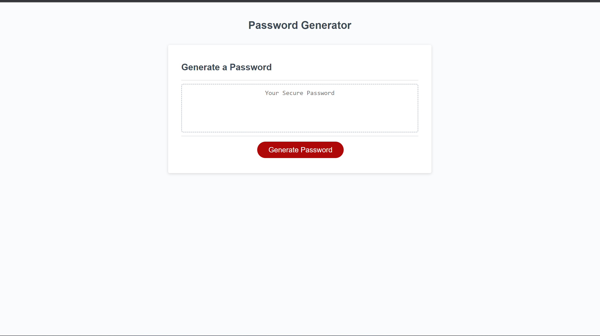
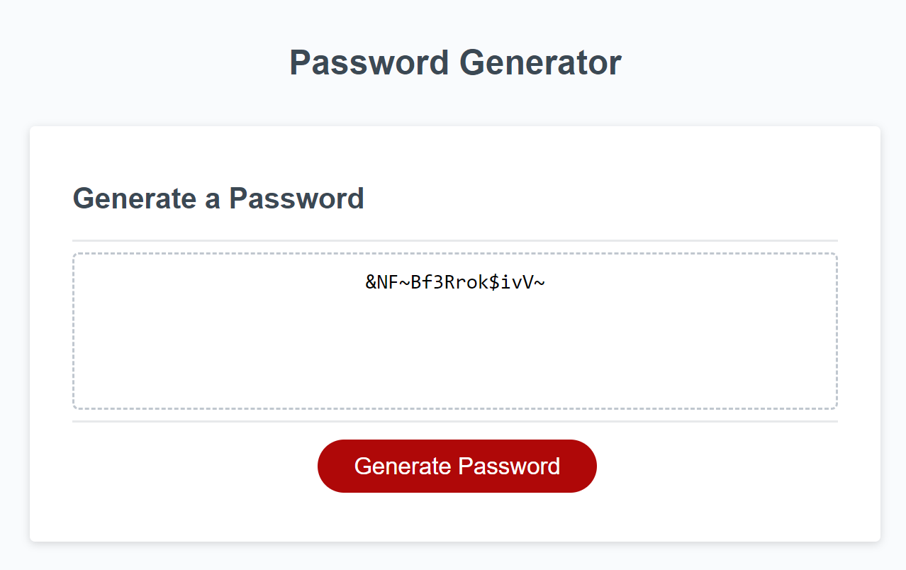

# 03 JavaScript: Password Generator
# Description
This is a Random password generator, you can use this website to create a random password 
to keep your accounts safe and keep unwanted people from being able to guess your password.

## Requirements
A conection to the internet.
A web browser downloaded on your device

## Usage
When you load the page you will see a button that says generate password.

 "Password Generator"

After clicking the button you will be given prompts on how you would like to modify said password.
it will ask what size you would like your password to be,
if you would like lower case letters,
upper case letters,
numbers, 
or special symbols (~, `, !, @, #, $, %, ^, &, *, &).

 "Prompt"

after all criteria questions have been answered it will print out your password into the display box for you to copy and use whever you would like.

## Credits
Marc Hamilton

## License

Please refer to the license in the github repo.

